# OpenPilot 架构与时序图文档

## 文档说明

本文档从多个视角展示OpenPilot系统的架构图和时序图：
1. **架构图**：框架架构、模块架构、消息驱动架构、任务调度架构
2. **时序图**：系统启动、控制循环、模型推理、CAN消息处理等关键功能的时序

---

## 第一部分：架构图

### 1.1 框架架构图：系统整体架构

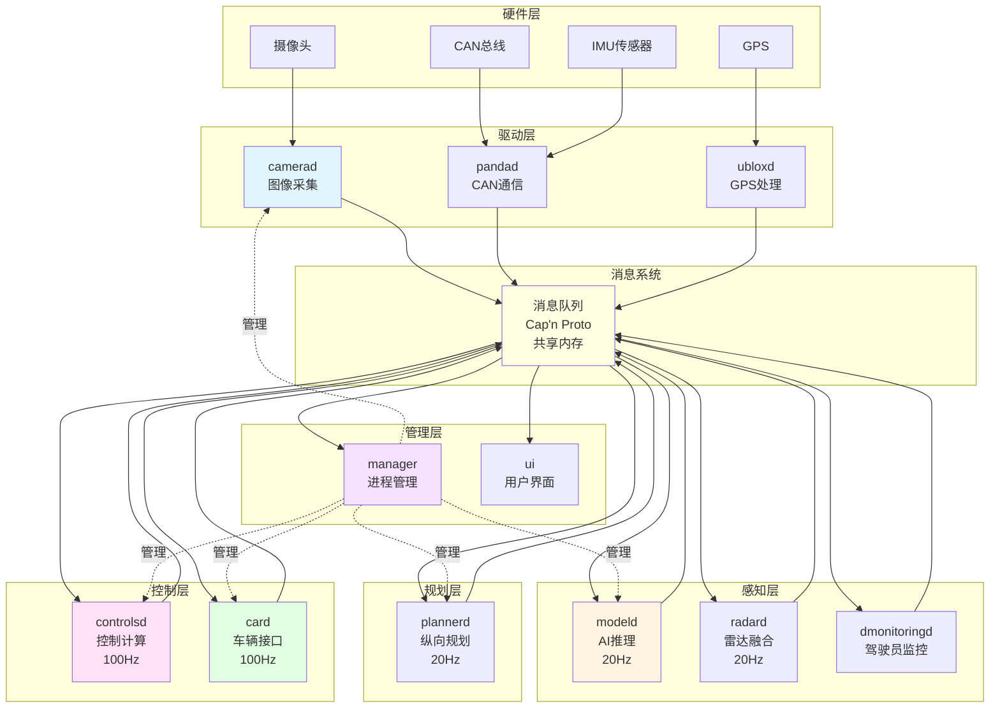

**架构说明**：
- **硬件层**：物理传感器和设备
- **驱动层**：硬件抽象，将硬件数据转换为消息
- **感知层**：AI推理和传感器融合
- **规划层**：路径和速度规划
- **控制层**：控制计算和执行
- **管理层**：进程管理和用户界面
- **消息系统**：所有模块通过消息队列通信

---

### 1.2 模块架构图：核心模块及其关系

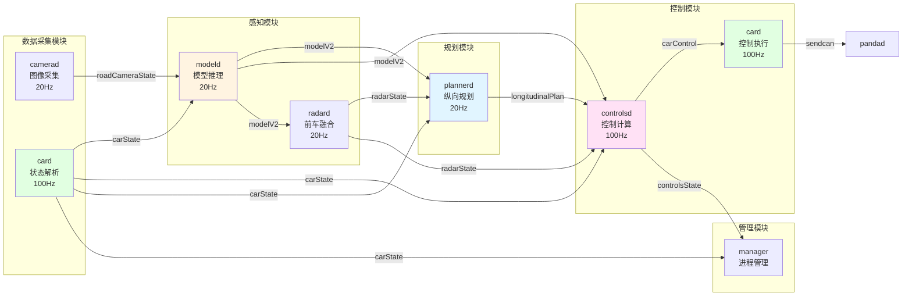

**模块关系说明**：
- **数据流**：摄像头 → 模型 → 规划 → 控制 → 执行
- **控制流**：控制模块驱动整个系统
- **反馈流**：车辆状态反馈到所有模块

---

### 1.3 消息驱动架构图：消息流和订阅关系

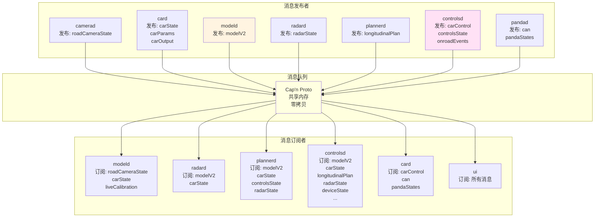

**消息驱动特点**：
- **发布/订阅模式**：发布者不知道订阅者
- **零拷贝**：共享内存，无数据复制
- **类型安全**：Cap'n Proto编译时类型检查
- **解耦设计**：模块间无直接依赖

---

### 1.4 任务调度架构图：进程优先级和调度

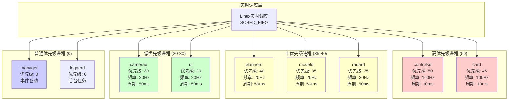

**调度策略说明**：
- **实时优先级**：关键控制进程使用SCHED_FIFO实时调度
- **优先级分层**：控制 > 规划 > 感知 > UI > 管理
- **频率匹配**：优先级与运行频率相关
- **资源隔离**：高优先级进程不受低优先级影响

---

## 第二部分：时序图

### 2.1 系统启动时序图

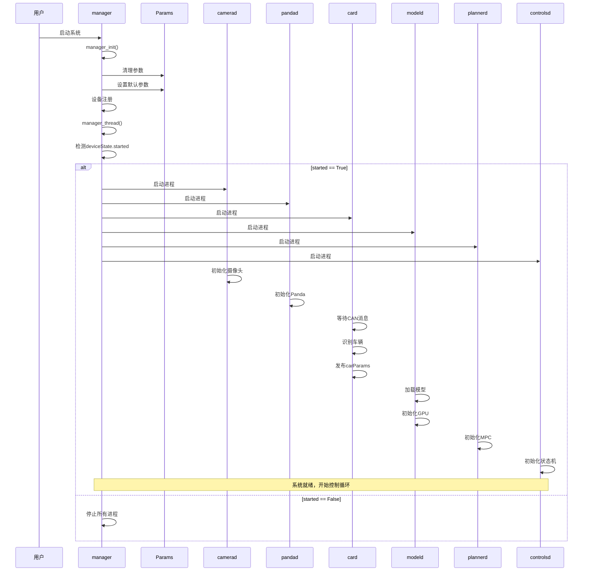

**启动流程说明**：
1. **初始化阶段**：参数清理、设备注册
2. **进程启动**：根据状态启动/停止进程
3. **模块初始化**：各模块完成自身初始化
4. **系统就绪**：所有模块就绪后开始控制循环

---

### 2.2 控制循环时序图（消息驱动）

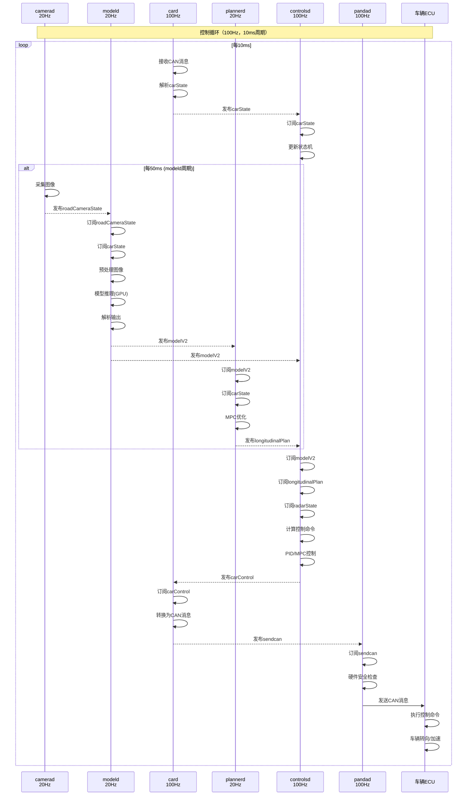

**控制循环说明**：
- **100Hz主循环**：controlsd和card以100Hz运行
- **20Hz感知循环**：modeld和plannerd以20Hz运行
- **消息驱动**：所有模块通过消息队列通信
- **实时保证**：高优先级保证控制及时性

---

### 2.3 模型推理时序图

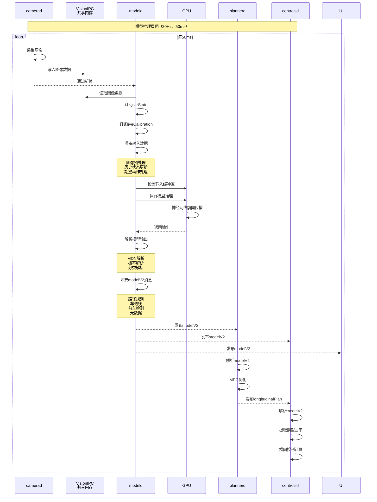

**模型推理说明**：
- **零拷贝**：VisionIPC共享内存，无数据复制
- **GPU加速**：模型推理在GPU上执行
- **多任务输出**：同时输出路径、车道线、前车等
- **实时推理**：50ms周期，<30ms推理时间

---

### 2.4 CAN消息处理时序图

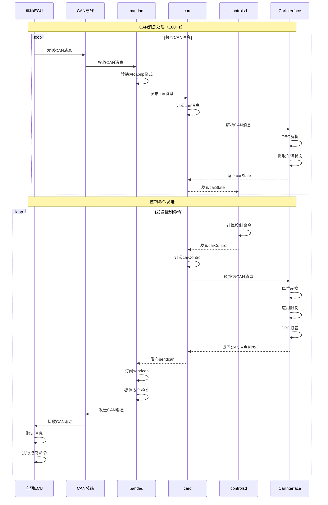

**CAN消息处理说明**：
- **双向通信**：接收车辆状态，发送控制命令
- **DBC解析**：自动解析CAN消息格式
- **安全验证**：Panda硬件级安全检查
- **实时保证**：100Hz频率，保证控制及时性

---

### 2.5 状态机转换时序图

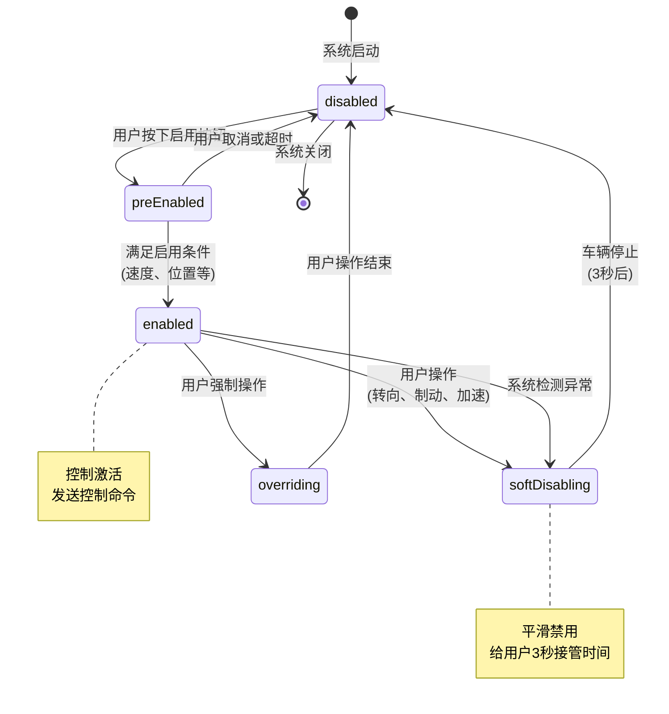

**状态机说明**：
- **disabled**：系统禁用，不发送控制命令
- **preEnabled**：准备启用，等待满足条件
- **enabled**：系统激活，发送控制命令
- **softDisabling**：软禁用，平滑过渡
- **overriding**：用户覆盖，系统禁用

---

### 2.6 纵向规划时序图

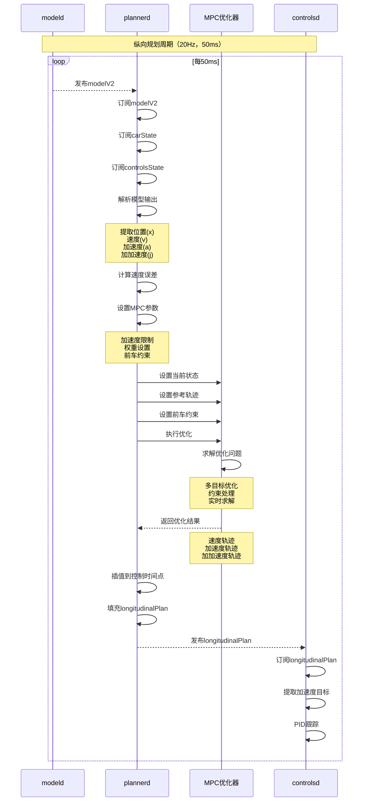

**纵向规划说明**：
- **MPC优化**：优化未来10秒速度轨迹
- **多目标**：速度跟踪、路径跟踪、舒适性
- **实时求解**：<10ms求解时间
- **PID跟踪**：controlsd使用PID跟踪MPC输出

---

### 2.7 横向控制时序图

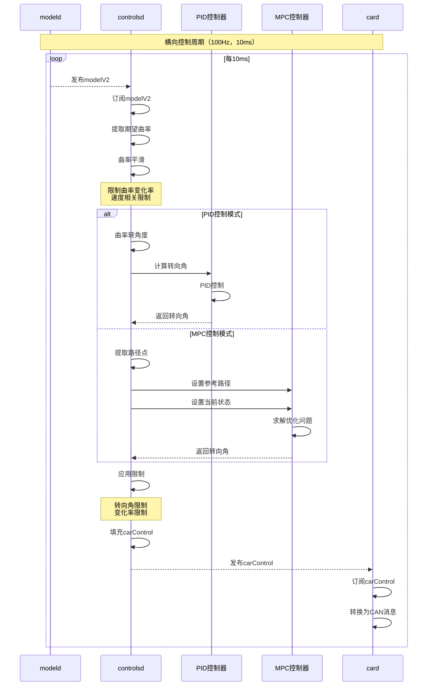

**横向控制说明**：
- **端到端**：模型直接输出期望曲率
- **双模式**：PID或MPC控制
- **平滑处理**：限制曲率变化率
- **实时控制**：100Hz频率

---

## 第三部分：关键交互模式

### 3.1 消息驱动模式

**特点**：
- 发布者不知道订阅者
- 异步通信
- 解耦设计

**优势**：
- 模块独立开发
- 易于扩展
- 故障隔离

### 3.2 调度驱动模式

**特点**：
- 固定频率运行
- 实时优先级
- 时间确定性

**优势**：
- 保证实时性
- 可预测性
- 资源隔离

### 3.3 混合模式

**实际系统**：
- 消息驱动：模块间通信
- 调度驱动：模块内执行
- 两者结合：保证实时性和解耦

---

## 总结

本文档从多个视角展示了OpenPilot系统的架构和时序：

1. **架构图**：
   - 框架架构：系统整体结构
   - 模块架构：核心模块关系
   - 消息驱动架构：消息流和订阅关系
   - 任务调度架构：进程优先级和调度

2. **时序图**：
   - 系统启动：进程启动流程
   - 控制循环：消息驱动的控制流程
   - 模型推理：AI推理流程
   - CAN消息处理：车辆通信流程
   - 状态机转换：系统状态管理
   - 纵向规划：MPC优化流程
   - 横向控制：路径跟踪流程

通过这些图表，可以清晰地理解OpenPilot系统的运行机制和模块间的交互方式。
